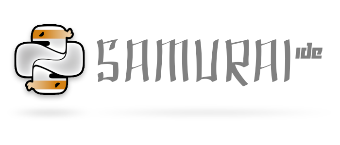

# samurai-ide-web v3.0

## Website for Samurai-IDE
The 3rd version of the website is developed alongside Samurai-IDE 3.

  

### User-submitted content

Any help is welcome for creating new issues and taking care of free issues. You'll understand that we cannot let you add a dancing Jesus or a Mr X photo to our awesome samurai site for the simple reason that **we** are the ones that want to add that kind of staff to the site.

If you really really REALLY want to help us, just get to our site (https://samurai-ide.org) and donate what your heart says.

### Get your own copy of the site (for development or learning):
(The site still has several parts named "ninja" but the images have been changed to samurai.)

    # clone the thing
    git clone git@github.com:poikilos/samurai-ide-web.git

    # create a virtualenv for it
    cd samurai-ide-web
    mkvirtualenv samuraiweb
    pwd >> $WORKON_HOME/samuraiweb/.project

    # install all requirements
    sudo apt-get install gcc libpq-dev -y
    sudo apt-get install python-dev  python-pip -y
    sudo apt-get install python3-dev python3-pip python3-venv python3-wheel -y
    # ^ See <https://stackoverflow.com/a/59596814/4541104> (avoid
    #   error: "The virtual environment was not created successfully because ensurepip is not
    #   available")
    pip install -r requirements/dev.txt

    # prepare it
    cd mezzaninja
    add2virtualenv .
    export DJANGO_SETTINGS_MODULE="settings.local"
    ./manage.py syncdb --migrate
    ./manage.py runserver

#### Note
Currently there are a lot of files & code deprecated that belongs to previous version of site. After completing the refactoring those files won't exist anymore.

### You want to tune up the CSS?

The Samurai-IDE website is being developed using LESS precompiler. If you want to style and don't get crazy in the process then you better learn it once for all and be happy the rest of your life.

It's simple:

1) get the latest version of less

    `npm install less`

2) add the path where Less was installed to your PATH env.

    `export PATH="$PATH:node_modules/less/bin"`

3) Done. Was simple or what?
